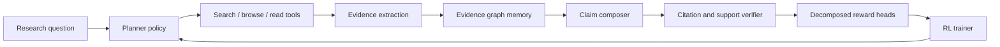

# EvidenceWeaver

<p align="center">
  
</p>

<p align="center">
  <a href="https://img.shields.io/badge/status-research_bootstrapping-0b6e4f?style=flat-square"></a>
  <a href="https://img.shields.io/badge/focus-agentic_rl-1f6feb?style=flat-square"></a>
  <a href="https://img.shields.io/badge/domain-deep_research_agents-b85c38?style=flat-square"></a>
  <a href="https://img.shields.io/badge/north_star-grounded_traceable_answers-5b4b8a?style=flat-square"></a>
</p>

<p align="center">
  <strong>Train deep research agents to be correct, grounded, and traceable.</strong>
</p>

EvidenceWeaver is a research-first open-source project for **citation-grounded reinforcement learning** in long-horizon research agents. The project starts from a simple belief:

> Strong answers are not enough. The next generation of research agents must also show where their claims came from, how those claims connect, and why the final answer deserves trust.

Today, many agentic RL systems still optimize heavily for final-task success while under-optimizing for evidence quality, citation faithfulness, and multi-hop reasoning structure. EvidenceWeaver aims to close that gap by combining:

- multi-turn tool-using agents
- evidence-graph memory instead of flat context dumping
- decomposed rewards for correctness, grounding, and traceability
- stability-aware training for long-horizon search behavior

## Why EvidenceWeaver

The current frontier in agentic RL is moving quickly, but the center of gravity is clear:

- long-horizon interaction matters more than single-turn reasoning
- reward design is becoming the bottleneck, not just model scale
- stability failures still break multi-turn RL in subtle ways
- search and research agents are a practical place to turn those lessons into something useful

EvidenceWeaver focuses on the part of the problem that still feels under-built:

1. `Correctness` - Did the agent answer the task?
2. `Grounding` - Are the key claims actually supported by retrieved evidence?
3. `Traceability` - Can a reviewer follow the evidence chain from question to conclusion?
4. `Efficiency` - Did the agent use search and reading budget well?

<p align="center">
  
</p>

## Project Thesis

EvidenceWeaver is built around three bets:

- **Bet 1: reward decomposition beats scalar outcome reward**
  - Instead of one final binary reward, we want separate signals for answer quality, citation support, evidence-chain completeness, source diversity, and tool efficiency.
- **Bet 2: evidence should be structured**
  - A good research agent should not only retrieve documents; it should maintain an evolving evidence graph that tracks claims, sources, contradictions, and unresolved gaps.
- **Bet 3: stability is a first-class research problem**
  - Long-horizon agentic RL collapses in ways that are easy to miss. We want reward shaping and rollout filtering that make those failures visible and tractable.

## What We Are Building



The long-term system has six core layers:

| Layer | Role | Why it matters |
| --- | --- | --- |
| `Agent` | plans, searches, reads, writes | the policy we want to improve |
| `Environment` | exposes search, browse, snapshot, and evaluation tools | long-horizon behavior needs realistic interaction |
| `Evidence graph` | stores claims, evidence, support, contradiction, and open gaps | helps the agent reason over structure instead of raw text blobs |
| `Reward server` | scores correctness, citation quality, chain completeness, diversity, and budget use | makes agentic RL more informative and controllable |
| `Trainer` | runs online or hybrid RL | connects environment outcomes back to the policy |
| `Evaluator` | measures answer quality and evidence quality separately | keeps the project honest |

## Design Principles

- **Research-first, product-aware**
  - The immediate goal is to produce a compelling research artifact and a reproducible open-source baseline.
- **Small, composable components**
  - We prefer clear interfaces over a giant framework.
- **Observable training**
  - If a reward term or rollout filter changes behavior, we should be able to inspect that change.
- **Evidence before elegance**
  - A simpler method with stronger verification is better than a flashy method with weak grounding.
- **Open by default**
  - Reproducible subsets, public reward recipes, and honest ablation plans matter more than vague claims.

## Initial Scope

The project will likely start with a narrow but meaningful slice:

- single-agent deep research on public-web or snapshot-based tasks
- citation-grounded answer generation
- lightweight evidence graph memory
- reward decomposition with a strong emphasis on support quality
- a benchmark recipe that can run on a small reproducible subset before scaling up

That first version is intentionally modest. The goal is not to solve all agentic RL at once; it is to make one sharp contribution that others can build on.

## Planned Workstreams

| Workstream | Near-term output | Longer-term ambition |
| --- | --- | --- |
| `Reward design` | citation-aware reward rubric and support scoring | learned or hybrid reward models for research agents |
| `Memory` | minimal evidence graph abstraction | richer graph reasoning over support and contradiction |
| `Training` | online or hybrid RL baseline | stability-aware long-horizon training recipes |
| `Evaluation` | reproducible public benchmark slice | evidence-centric leaderboard and diagnostic suite |
| `Agent UX` | readable trajectory and citation traces | human-auditable research reports |

## Roadmap

### Phase 0 - Foundation

- [x] Define project thesis
- [x] Create public repo and project narrative
- [ ] Lock a first benchmark slice
- [ ] Decide the first trainer integration
- [ ] Specify version `v0` interfaces for agent, reward, and evaluation

### Phase 1 - Minimal Research Baseline

- [ ] Build a simple search-read-write agent loop
- [ ] Implement evidence graph memory
- [ ] Implement citation grounding reward
- [ ] Add offline evaluation for answer quality and citation quality
- [ ] Publish first reproducible baseline trajectories

### Phase 2 - Agentic RL

- [ ] Run online or hybrid RL on the baseline environment
- [ ] Add chain completeness and source diversity rewards
- [ ] Add stability diagnostics and rollout filtering
- [ ] Benchmark against strong non-RL and outcome-only RL baselines

### Phase 3 - Research Artifact

- [ ] Write a workshop-quality paper draft
- [ ] Release ablations, diagnostics, and failure cases
- [ ] Open contribution lanes for environment, reward, and eval extensions
- [ ] Turn the repo into a living benchmark and training recipe

## Research Questions

These are the questions we want the repo to sharpen over time:

1. Can citation-grounded rewards improve factual support quality without crushing exploration?
2. What reward decomposition best correlates with human judgment for deep research tasks?
3. Does evidence-graph memory help more during inference, training, or both?
4. Which instability signals predict long-horizon policy collapse earliest?
5. How much of the benefit comes from better reward design versus better environment design?

## Project Layout

This repository is still at day zero, but the intended layout is already visible:

```text
.
|-- README.md
|-- docs/
|   |-- assets/
|   |   |-- banner.svg
|   |   `-- evidence-loop.svg
|   |-- benchmark-slice.md
|   |-- interfaces.md
|   |-- related-work.md
|   |-- research-agenda.md
|   `-- reward-design.md
|-- CONTRIBUTING.md
|-- .github/
|   `-- ISSUE_TEMPLATE/
`-- paper/
    `-- outline.md
```

## Read Next

- [`docs/related-work.md`](docs/related-work.md) - the current map of agentic RL work most relevant to EvidenceWeaver
- [`docs/research-agenda.md`](docs/research-agenda.md) - milestones, hypotheses, and experimental shape
- [`docs/benchmark-slice.md`](docs/benchmark-slice.md) - the first reproducible benchmark proposal
- [`docs/interfaces.md`](docs/interfaces.md) - a minimal `v0` interface sketch for agent, reward, and eval
- [`docs/reward-design.md`](docs/reward-design.md) - the first reward decomposition sketch
- [`paper/outline.md`](paper/outline.md) - an early paper structure for the project
- [`CONTRIBUTING.md`](CONTRIBUTING.md) - how to contribute high-signal ideas and changes

## Related Work Snapshot

EvidenceWeaver is inspired by recent work across:

- stability and training science for long-horizon agentic RL
- general-purpose agent RL infrastructure
- deep search and research agents
- software and GUI agents that reveal the practical constraints of multi-turn training

The current reading list includes:

- `RAGEN` - multi-turn RL for reasoning agents
- `RAGEN-2` - stability analysis and template-collapse diagnosis
- `ARLArena` - a unified framework for stable agentic RL
- `Agent Lightning` and `AgentRL` - agent RL training infrastructure
- `ASearcher`, `DeepDive`, and `CaRR` - deep search and evidence-sensitive search agents
- `ComputerRL`, `SWE-RL`, and `SWE-Master` - domain-specific long-horizon agent RL

See [`docs/related-work.md`](docs/related-work.md) for notes and links.

## Contributing

This project is very early, so the best contributions are high-signal and concrete:

- benchmark suggestions for deep research tasks
- reward definitions and scoring ideas
- environment wrappers for reproducible browsing or snapshot-based research
- baselines, ablations, and failure analyses
- critiques of the problem framing

If you want to help, open an issue with one of these shapes:

- `problem framing`
- `benchmark proposal`
- `reward idea`
- `eval gap`
- `implementation plan`
- `related work note`

## Status

EvidenceWeaver is currently a **research bootstrapping repository**. There are no performance claims yet, no training results yet, and no stable API yet. This is deliberate: the project should earn trust by publishing clean reasoning, good baselines, and honest evidence as it grows.

If we do this well, EvidenceWeaver can become more than a single paper. It can become a practical reference point for how to train research agents that are not just impressive, but inspectable.
