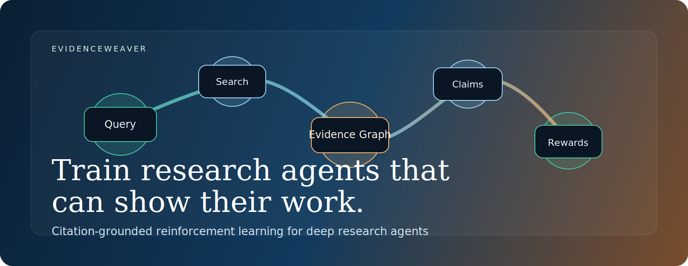
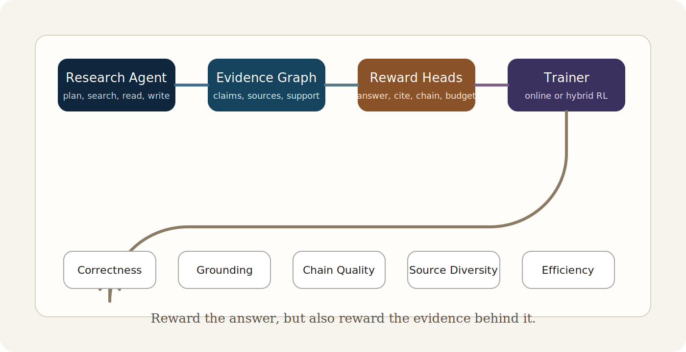
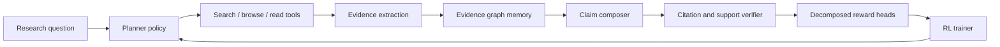

# EvidenceWeaver

<p align="center">
  
</p>

<p align="center">
  <a href="https://img.shields.io/badge/status-research_bootstrapping-0b6e4f?style=flat-square"></a>
  <a href="https://img.shields.io/badge/focus-agentic_rl-1f6feb?style=flat-square"></a>
  <a href="https://img.shields.io/badge/domain-deep_research_agents-b85c38?style=flat-square"></a>
  <a href="https://img.shields.io/badge/north_star-grounded_traceable_answers-5b4b8a?style=flat-square"></a>
  <a href="https://github.com/Jasvina/EvidenceWeaver/actions/workflows/ci.yml"></a>
  <a href="https://github.com/Jasvina/EvidenceWeaver/actions/workflows/pages.yml"></a>
</p>

<p align="center">
  <strong>Train deep research agents to be correct, grounded, and traceable.</strong>
</p>

EvidenceWeaver is a research-first open-source project for **citation-grounded reinforcement learning** in long-horizon research agents. The project starts from a simple belief:

> Strong answers are not enough. The next generation of research agents must also show where their claims came from, how those claims connect, and why the final answer deserves trust.

Today, many agentic RL systems still optimize heavily for final-task success while under-optimizing for evidence quality, citation faithfulness, and multi-hop reasoning structure. EvidenceWeaver aims to close that gap by combining:

- multi-turn tool-using agents
- evidence-graph memory instead of flat context dumping
- decomposed rewards for correctness, grounding, and traceability
- stability-aware training for long-horizon search behavior

## Start Here

If you want the fastest path from repo visit to runnable artifact, use this order:

1. Open `docs/index.html` locally, or use the GitHub Pages deployment wired from `docs/`, for the dependency-free project site and visual overview.
2. Read the quickstart below and run the baseline once.
3. Inspect `docs/progress-and-roadmap.md` for the current benchmark state and next milestone.

Quickstart:

```bash
python3 -m venv .venv
. .venv/bin/activate
pip install -e .
python3 -m unittest discover -s tests -v
python3 -m evidenceweaver.agent.baseline \
  benchmarks/snapshot_v0/tasks/agent_training_stack_task.json \
  --output /tmp/evidenceweaver_run.json
python3 -m evidenceweaver.eval.offline \
  benchmarks/snapshot_v0/tasks/agent_training_stack_task.json \
  /tmp/evidenceweaver_run.json \
  --emit-scored-run /tmp/evidenceweaver_scored_run.json
```

Now / Next / Later:

- `Now` - maintain a clean executable scaffold with reproducible benchmark artifacts and honest diagnostics
- `Next` - expand harder real-case tasks, add source sidecars, and make failure analysis more explicit
- `Later` - integrate online or hybrid RL once the benchmark and reward loop are harder to game

## What Exists Today

- `Baseline agent` - deterministic search-read-write loop that emits `run-artifact.v0` JSON
- `Evidence graph` - explicit source, claim, duplicate, support, and open-question structure
- `Offline evaluator` - decomposed scoring for answer quality, citation quality, and traceability
- `Reward composition` - inspectable reward bundle construction from evaluation metrics
- `Benchmarks` - `snapshot_v0` plus a twelve-task `real_cases_v1` tuning suite
- `Open-source surface` - static landing page, CI, Pages deployment, issue templates, PR template, changelog, conduct, and security policy

## Why EvidenceWeaver

The current frontier in agentic RL is moving quickly, but the center of gravity is clear:

- long-horizon interaction matters more than single-turn reasoning
- reward design is becoming the bottleneck, not just model scale
- stability failures still break multi-turn RL in subtle ways
- search and research agents are a practical place to turn those lessons into something useful

EvidenceWeaver focuses on the part of the problem that still feels under-built:

1. `Correctness` - Did the agent answer the task?
2. `Grounding` - Are the key claims actually supported by retrieved evidence?
3. `Traceability` - Can a reviewer follow the evidence chain from question to conclusion?
4. `Efficiency` - Did the agent use search and reading budget well?

<p align="center">
  
</p>

## Project Thesis

EvidenceWeaver is built around three bets:

- **Bet 1: reward decomposition beats scalar outcome reward**
  - Instead of one final binary reward, we want separate signals for answer quality, citation support, evidence-chain completeness, source diversity, and tool efficiency.
- **Bet 2: evidence should be structured**
  - A good research agent should not only retrieve documents; it should maintain an evolving evidence graph that tracks claims, sources, contradictions, and unresolved gaps.
- **Bet 3: stability is a first-class research problem**
  - Long-horizon agentic RL collapses in ways that are easy to miss. We want reward shaping and rollout filtering that make those failures visible and tractable.

## Minimal Executable Scaffold

This repository now includes a minimal Python scaffold so the project can move from ideas to inspectable artifacts:

- `src/evidenceweaver/agent/` contains a deterministic search-read-write baseline agent
- `src/evidenceweaver/graph/` contains explicit evidence-graph primitives and a mutable builder
- `src/evidenceweaver/reward/` contains reward composition helpers and a reward CLI
- `src/evidenceweaver/` contains typed loaders and a small offline evaluator
- `schemas/` defines `v0` JSON schemas for task bundles and run artifacts
- `examples/` contains a synthetic snapshot-based task plus good and weak runs
- `benchmarks/snapshot_v0/` contains the first more realistic paraphrased snapshot benchmark seeds
- `benchmarks/real_cases_v1/` contains the first real-example-driven accuracy-optimization suite
- `tests/` verifies parsing, scoring, and the CLI path

Quick local checks:

```bash
PYTHONPATH=src python3 -m unittest discover -s tests -v
PYTHONPATH=src python3 -m evidenceweaver.eval.offline \
  examples/tasks/synthetic_delay_task.json \
  examples/runs/synthetic_delay_good_run.json
PYTHONPATH=src python3 -m evidenceweaver.agent.baseline \
  benchmarks/snapshot_v0/tasks/agentic_rl_stability_task.json
PYTHONPATH=src python3 -m evidenceweaver.eval.offline \
  benchmarks/snapshot_v0/tasks/agentic_rl_stability_task.json \
  /tmp/evidenceweaver_run.json \
  --emit-scored-run /tmp/evidenceweaver_scored_run.json
PYTHONPATH=src python3 -m evidenceweaver.reward.compose \
  benchmarks/snapshot_v0/tasks/agent_training_stack_task.json \
  /tmp/evidenceweaver_run.json
PYTHONPATH=src python3 -m evidenceweaver.graph.analyze \
  /tmp/evidenceweaver_run.json
PYTHONPATH=src python3 -m evidenceweaver.optimize.accuracy \
  benchmarks/real_cases_v1/tasks
```

## What We Are Building



The long-term system has six core layers:

| Layer | Role | Why it matters |
| --- | --- | --- |
| `Agent` | plans, searches, reads, writes | the policy we want to improve |
| `Environment` | exposes search, browse, snapshot, and evaluation tools | long-horizon behavior needs realistic interaction |
| `Evidence graph` | stores claims, evidence, support, contradiction, and open gaps | helps the agent reason over structure instead of raw text blobs |
| `Reward server` | scores correctness, citation quality, traceability, diversity, and budget use | makes agentic RL more informative and controllable |
| `Trainer` | runs online or hybrid RL | connects environment outcomes back to the policy |
| `Evaluator` | measures answer quality and evidence quality separately | keeps the project honest |

## Design Principles

- **Research-first, product-aware**
  - The immediate goal is to produce a compelling research artifact and a reproducible open-source baseline.
- **Small, composable components**
  - We prefer clear interfaces over a giant framework.
- **Observable training**
  - If a reward term or rollout filter changes behavior, we should be able to inspect that change.
- **Evidence before elegance**
  - A simpler method with stronger verification is better than a flashy method with weak grounding.
- **Open by default**
  - Reproducible subsets, public reward recipes, and honest ablation plans matter more than vague claims.

## Initial Scope

The project will likely start with a narrow but meaningful slice:

- single-agent deep research on public-web or snapshot-based tasks
- citation-grounded answer generation
- lightweight evidence graph memory
- reward decomposition with a strong emphasis on support quality
- a benchmark recipe that can run on a small reproducible subset before scaling up

That first version is intentionally modest. The goal is not to solve all agentic RL at once; it is to make one sharp contribution that others can build on.

## Planned Workstreams

| Workstream | Near-term output | Longer-term ambition |
| --- | --- | --- |
| `Reward design` | citation-aware reward rubric and support scoring | learned or hybrid reward models for research agents |
| `Memory` | minimal evidence graph abstraction | richer graph reasoning over support and contradiction |
| `Training` | online or hybrid RL baseline | stability-aware long-horizon training recipes |
| `Evaluation` | reproducible public benchmark slice | evidence-centric leaderboard and diagnostic suite |
| `Agent UX` | readable trajectory and citation traces | human-auditable research reports |

## Roadmap

### Phase 0 - Foundation

- [x] Define project thesis
- [x] Create public repo and project narrative
- [x] Lock a first benchmark slice
- [ ] Decide the first trainer integration
- [x] Specify version `v0` interfaces for agent, reward, and evaluation

### Phase 1 - Minimal Research Baseline

- [x] Build a simple search-read-write agent loop
- [ ] Implement evidence graph memory
- [ ] Implement citation grounding reward
- [x] Add offline evaluation for answer quality, citation quality, and traceability
- [ ] Publish first reproducible baseline trajectories

### Phase 2 - Agentic RL

- [ ] Run online or hybrid RL on the baseline environment
- [ ] Add chain completeness and source diversity rewards
- [ ] Add stability diagnostics and rollout filtering
- [ ] Benchmark against strong non-RL and outcome-only RL baselines

### Phase 3 - Research Artifact

- [x] Write a pre-results paper draft
- [ ] Release ablations, diagnostics, and failure cases
- [ ] Open contribution lanes for environment, reward, and eval extensions
- [ ] Turn the repo into a living benchmark and training recipe

## Research Questions

These are the questions we want the repo to sharpen over time:

1. Can citation-grounded rewards improve factual support quality without crushing exploration?
2. What reward decomposition best correlates with human judgment for deep research tasks?
3. Does evidence-graph memory help more during inference, training, or both?
4. Which instability signals predict long-horizon policy collapse earliest?
5. How much of the benefit comes from better reward design versus better environment design?

## Project Layout

This repository is still at day zero, but the intended layout is already visible:

```text
.
|-- README.md
|-- LICENSE
|-- pyproject.toml
|-- docs/
|   |-- assets/
|   |   |-- banner.svg
|   |   `-- evidence-loop.svg
|   |-- benchmark-slice.md
|   |-- interfaces.md
|   |-- related-work.md
|   |-- research-agenda.md
|   `-- reward-design.md
|-- examples/
|   |-- runs/
|   `-- tasks/
|-- CONTRIBUTING.md
|-- .github/
|   `-- ISSUE_TEMPLATE/
|-- benchmarks/
|   `-- snapshot_v0/
|-- schemas/
|-- src/
|   `-- evidenceweaver/
|-- tests/
`-- paper/
    |-- draft.md
    `-- outline.md
```

## Read Next

- [`docs/related-work.md`](docs/related-work.md) - the current map of agentic RL work most relevant to EvidenceWeaver
- [`docs/research-agenda.md`](docs/research-agenda.md) - milestones, hypotheses, and experimental shape
- [`docs/benchmark-slice.md`](docs/benchmark-slice.md) - the first reproducible benchmark proposal
- [`docs/progress-and-roadmap.md`](docs/progress-and-roadmap.md) - current progress, latest benchmark results, and future optimization plan
- [`docs/interfaces.md`](docs/interfaces.md) - a minimal `v0` interface sketch for agent, reward, and eval
- [`docs/reward-design.md`](docs/reward-design.md) - the first reward decomposition sketch
- [`schemas/task-bundle.v0.json`](schemas/task-bundle.v0.json) - the `v0` task bundle contract
- [`schemas/run-artifact.v0.json`](schemas/run-artifact.v0.json) - the `v0` run artifact contract
- [`examples/tasks/synthetic_delay_task.json`](examples/tasks/synthetic_delay_task.json) - a synthetic snapshot-based benchmark example
- [`examples/runs/synthetic_delay_good_run.json`](examples/runs/synthetic_delay_good_run.json) - a strong example trajectory artifact
- [`benchmarks/snapshot_v0/README.md`](benchmarks/snapshot_v0/README.md) - the first realistic snapshot benchmark seeds and provenance notes
- [`paper/draft.md`](paper/draft.md) - the current pre-results paper draft
- [`paper/outline.md`](paper/outline.md) - an early paper structure for the project
- [`CONTRIBUTING.md`](CONTRIBUTING.md) - how to contribute high-signal ideas and changes
- [`CODE_OF_CONDUCT.md`](CODE_OF_CONDUCT.md) - collaboration standards for contributors and maintainers
- [`SECURITY.md`](SECURITY.md) - how to report security or artifact-integrity issues responsibly
- [`CHANGELOG.md`](CHANGELOG.md) - a running record of repo-facing changes

## Baseline Agent

The repository now includes a deterministic baseline agent that can search, read, write claims, and emit a `run-artifact.v0` JSON file.

Run the agent on a task:

```bash
PYTHONPATH=src python3 -m evidenceweaver.agent.baseline \
  benchmarks/snapshot_v0/tasks/agent_training_stack_task.json \
  --output /tmp/evidenceweaver_run.json
```

Score the generated run:

```bash
PYTHONPATH=src python3 -m evidenceweaver.eval.offline \
  benchmarks/snapshot_v0/tasks/agent_training_stack_task.json \
  /tmp/evidenceweaver_run.json
```

This baseline is intentionally simple. It is not meant to be competitive; it is meant to give the project a stable executable reference point for interface design, evaluation changes, and future RL work.

## Evidence Graph Loop

The baseline loop is now explicitly graph-aware:

- source nodes are created for the task snapshot
- opened documents are marked in the evidence graph
- each generated claim becomes a claim node with support edges back to cited sources
- uncovered prompt-focus tokens are recorded as open questions
- those open questions can trigger follow-up search queries on tasks with enough budget
- the evaluator can enrich a run artifact with a decomposed `reward_bundle`

This gives the repository a concrete closed loop:

`task bundle -> baseline agent -> evidence graph -> run artifact -> evaluator -> reward bundle`

The run artifact now also includes `diagnostics`, including:

- executed search queries
- iteration count
- opened source IDs
- prompt-focus coverage ratio
- remaining uncovered focus tokens

The graph layer also now emits simple claim-to-claim relationship edges:

- `supports`
- `contradicts`
- `derived_from`
- `duplicates`

There is also a lightweight graph-analysis CLI for turning a scored run into a graph summary that is easier to inspect in isolation.

## Benchmark Seeds

`benchmarks/snapshot_v0/` is the first step beyond the fully synthetic example in `examples/`.

Current tasks:

- `agentic_rl_stability_task` - why recent work treats stability as a core issue
- `agent_training_stack_task` - how Agent Lightning, AgentRL, and rLLM structure training
- `deep_search_reward_task` - why deep search agents need evidence-sensitive rewards

These tasks use paraphrased snapshot digests anchored to primary-source URLs, which keeps the repository lightweight while still exercising research-style synthesis and citation behavior.

## Real-Case Optimization

The repository now also includes `benchmarks/real_cases_v1/`, a twelve-task suite used to tune the deterministic baseline against more realistic examples.

Run the suite optimizer:

```bash
PYTHONPATH=src python3 -m evidenceweaver.optimize.accuracy \
  benchmarks/real_cases_v1/tasks
```

Current repository snapshot:

- suite size: `12` tasks
- saved sweep result: `benchmarks/real_cases_v1/results/baseline_sweep.json`
- current best config aligns with the repository default baseline configuration
- current best average `overall_score` on the expanded suite is about `0.8611`
- the harder expanded suite now exposes weak spots in diagnostics and trajectory-credit tasks instead of saturating near-perfect scores
- each real-case task now carries provenance metadata and a task-local source sidecar so URLs, digests, and refresh hints travel with the artifact
- optimizer output now includes a failure summary with weakest-task tracking, missed claim IDs, missing source IDs, and next-step recommendations

## Related Work Snapshot

EvidenceWeaver is inspired by recent work across:

- stability and training science for long-horizon agentic RL
- general-purpose agent RL infrastructure
- deep search and research agents
- software and GUI agents that reveal the practical constraints of multi-turn training

The current reading list includes:

- `RAGEN` - multi-turn RL for reasoning agents
- `RAGEN-2` - stability analysis and template-collapse diagnosis
- `ARLArena` - a unified framework for stable agentic RL
- `Agent Lightning` and `AgentRL` - agent RL training infrastructure
- `ASearcher`, `DeepDive`, and `CaRR` - deep search and evidence-sensitive search agents
- `ComputerRL`, `SWE-RL`, and `SWE-Master` - domain-specific long-horizon agent RL

See [`docs/related-work.md`](docs/related-work.md) for notes and links.

## Contributing

This project is very early, so the best contributions are high-signal and concrete:

- benchmark suggestions for deep research tasks
- reward definitions and scoring ideas
- environment wrappers for reproducible browsing or snapshot-based research
- baselines, ablations, and failure analyses
- critiques of the problem framing

If you want to help, start with one of these issue or PR shapes:

- `benchmark:` - propose a new task family, snapshot recipe, or evaluation setup
- `reward:` - add a reward term, anti-hacking check, or scoring rule
- `failure-case:` - document a trajectory or behavior that broke in a useful way
- `docs:` - improve onboarding, navigation, CI, contributor workflow, or benchmark documentation
- `eval:` - report a blind spot or misleading signal in the current evaluation loop
- `infra:` - tighten automation, artifact flow, or reproducibility mechanics

## Status

EvidenceWeaver is currently a **research bootstrapping repository**. There are no training-results claims yet and no stable API yet. This is deliberate: the project should earn trust by publishing clean reasoning, good baselines, and honest evidence as it grows.

If we do this well, EvidenceWeaver can become more than a single paper. It can become a practical reference point for how to train research agents that are not just impressive, but inspectable.
